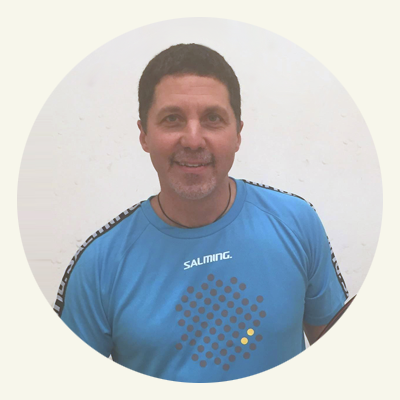
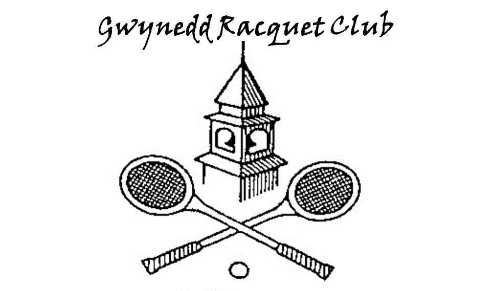
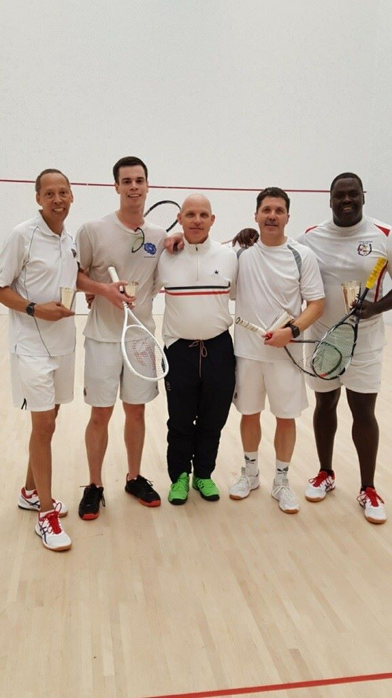
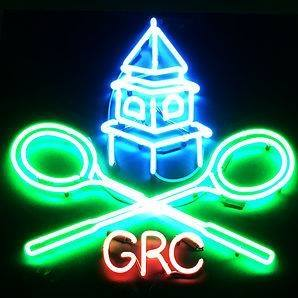

---
output:
  html_document:
    css: "www/css/modest.css"
---
```{r setup, include=FALSE, echo=FALSE}
library(htmltools)
library(vembedr)
library(shiny)
GG_Link <- "https://www.youtube.com/watch?v=xNOGZ0ZzY7Q&t=1"
```
## Squash Time

Im a HUUUUUGE Squash player.

Catch me on the court












<iframe width="560" height="315" src="https://www.youtube.com/watch?v=xNOGZ0ZzY7Q&t=1" frameborder="0" allowfullscreen></iframe>

